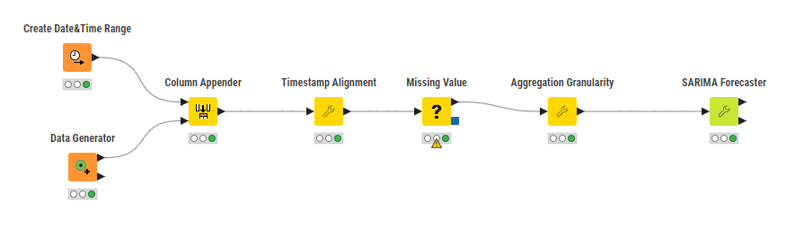
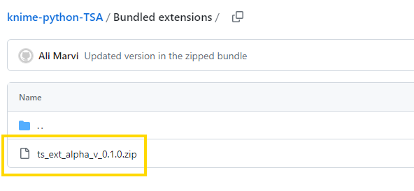
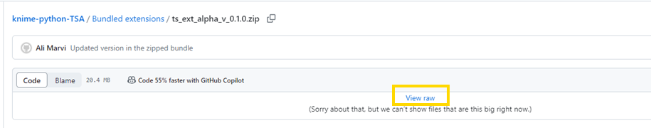
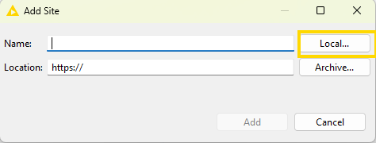
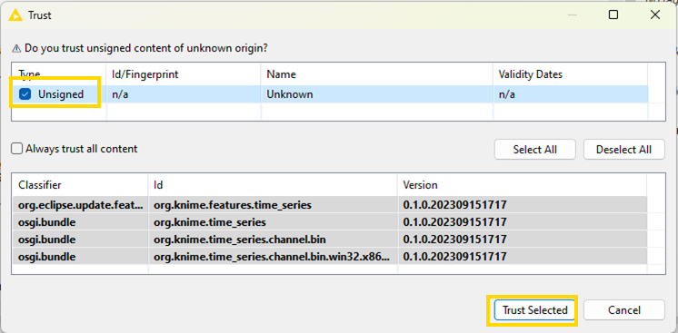

# Time Series Analysis Extension for KNIME

This repository contains code of the Time Series Analysis extension for [KNIME Analytics Platform](https://www.knime.com/knime-analytics-platform "KNIME"). This extension provides nodes for time series modeling, analysis, and processing.
 

 

This extension was developed by Ali Asghar Marvi & Corey Weisinger from the evangelism team at [KNIME](https://www.knime.com/ "KNIME"). The project's goal is to utilize the bundled Python packages shipped with KNIME, harness its functionalities, and incorporate it within native KNIME nodes for Time Series Analysis. 

 

This extension is based on [Pandas](https://pandas.pydata.org/ "Pandas") DateTime functionality and [Statsmodels](https://www.statsmodels.org/stable/index.html "Statsmodels") library. The supported data types for timestamps are defined in the [KNIME-Core](https://github.com/knime/knime-core/tree/master/org.knime.core/src/eclipse/org/knime/core/data/date "KNIME Date Types").

 

# Installation

This extension is not available on the KNIME's update site yet. However, it can be manually installed from the "Bundled extensions" directory by locally creating the update site to the bundled folder of the extension.
 

### Step 1:
Select the zip file of the version you wish to install. You can navigate to the "Bundled extensions" directory in the repository and select the version you wish to install. Please refer to the figure below:
 

### Step 2:
Click on the zipped file, as shown in the image above, and click on "View raw" to download it (figure below). 
 

### Step 3:
Extract the file contents in the zipped file. 

### Step 4:
Now we will add the local update site pointing to the Time Series extension. Open the KNIME Analytics Platform and navigate to the following preferences window to add the software site at <i>File → Preferences → Install/Update → Available Software Sites</i>. 
 
As shown in the figure below, select "Available Software Sites" first and then click the "Add" button.
 

### Step 5:
Set any name to the extension and click on "Local". Select the "bundled" folder in the extracted folder from Step 3. Click "Add" and then the "Apply and Close" button to close the "Preferences" window.
 

### Step 6:
Install the Time Series extension via <i>File → Install KNIME Extensions</i>. You will be prompted to verify the contents being installed. Check the "Unsigned" option and click the "Trust & Selected" button. 
 

## Package Organization

* `scripts`: This directory consists of the source code for all KNIME Time Series Extension nodes.
* `Bundled extensions`: Contains zipped files of all the releases of the extension.
* `icons`: All the icons used for the nodes, categories, and extension
* `bundling_ymls`: `.yml` files for each operating system containing the list of packages and compatible versions with the operating system.
* `tests`: Testflows for each node.
